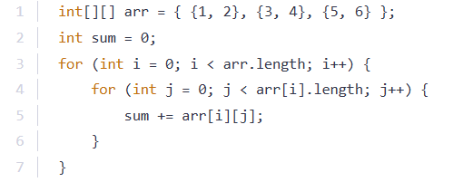

# 
Quiz

## 
1. How do you declare a 2D array in Java?

### 
a. Int[][] arr = new int[];

### 
b. Int[][] arr = new int[]5[5];

### 
c. Int[5][5] arr = new int[][];

### 
d. Int[][] arr = new int[][];

## 
2. Which of the following is the correct way to initialize a 2D array in Java?

### 
a. Int[][] arr = {{1,2,3}, {4,5,6}};

### 
b. Int[][] arr = int[] {1,2,3,4,5,6};

### 
c. Int[][] arr = new int[3];

### 
d. Int[][] arr = new int(3,2);

## 
3. How can you access the element in the second row and third column of a 2D array arr?

### 
a. arr[3][2];

### 
b. arr[2][3];

### 
c. arr[1][2];

### 
d. arr[2][1];

## 
4. Which loop is best suited for iterating over all elements in a 2D array in Java?

### 
a. single for-loop

### 
b. nested for-loop

### 
c. do-while loop

### 
d. enhanced for loop without nesting

## 
5. What does the following code do?

## 
int sum = 0; for (int[] row : arr) { for (int num : row) { sum += num; } }

### 
a. Finds the largest number in the array

### 
b. It finds the smallest number in the array

### 
c. It computes the sum of all the elements in the array

### 
d. It computes the product of all the elements in the array

## 
6. How can you find the largest number in a 2D array arr?

### 
a. Int max = Array.max(arr);

### 
b. Int max = arr[0][0]; for(int row : arr){for (int num : row){if (num > max){max=num}};

### 
c. Int max = collections.max(arr);

### 
d. Int max = arr[][]; for(int num :arr){if (num > max ){max = num}}

## 
7. What will the sum value be after the following code executes?

### 
a. 6

### 
b. 12

### 
c. 16

### 
d. 21

## 
8. What is the correct way to initialize an ArrayList in Java?

### 
a. ArrayList arr = new ArrayList();

### 
b. ArrayList<int> arr = new ArrayList();

### 
c. ArrayList<Integer> arr = new ArrayList<>();

### 
d. ArrayList<int[]> arr = new ArrayList();

## 
9. Which method is used to get the size of an ArrayList in Java?

### 
a. arr.length;

### 
b. arr.size();

### 
c. arr.getsize();

### 
d. arr.count();

## 
10. How do you add an element to an ArrayList in Java?

### 
a. arr.add(5);

### 
b. arr.insert(5);

### 
c. arr.append(5);

### 
d. arr.put(5);

# 
Answers

## 
1. d. Int[][] arr = new int[][];

## 
2. a. Int[][] arr = {{1,2,3}, {4,5,6}};

## 
3. c. arr[1][2];

## 
4. d.	enhanced for loop without nesting

## 
5. c.	It computes the sum of all the elements in the array

## 
6. b.	Int max = arr[0][0]; for(int row : arr){for (int num : row){if (num > max){max=num}}};

## 
7. d. 21

## 
8. c.	ArrayList<Integer> arr = new ArrayList<>();

## 
9. b.	arr.size();

## 
10. a. arr.add(5);

[githublink]()
